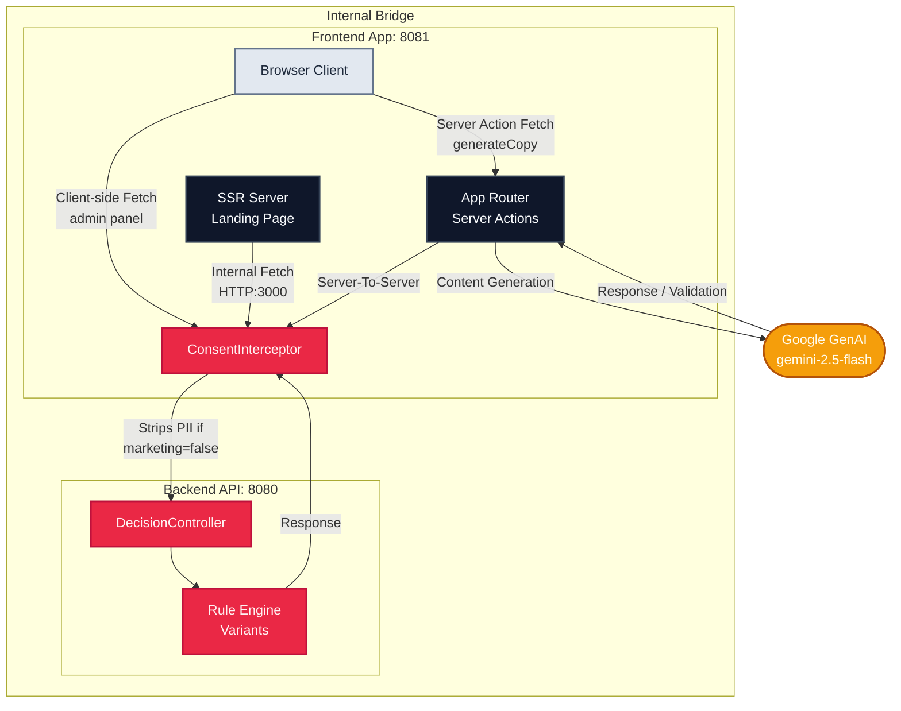
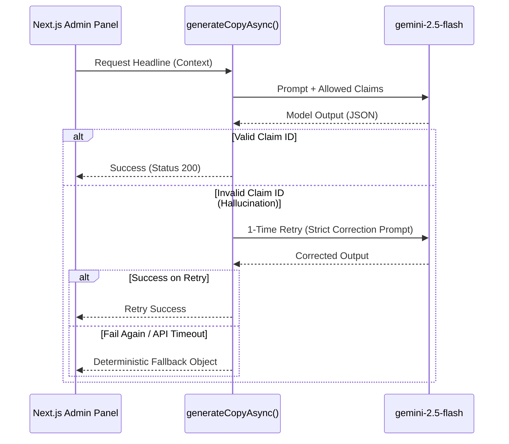

# Application Architecture

This document visualizes the flow of data across the NestJS Rules Engine, the Next.js Client Boundaries, and the Google GenAI Integration.

## System Workflow

## Security & Privacy Logic

